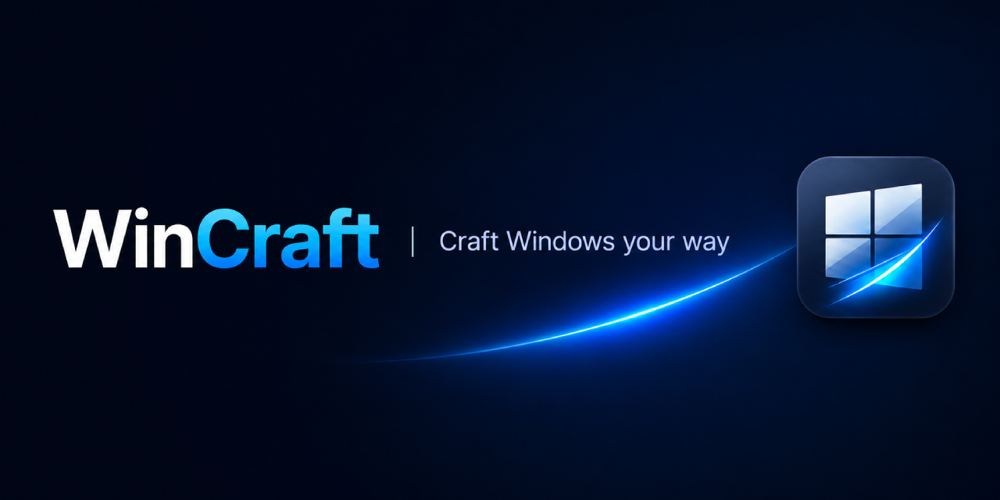

# WinCraft

     

 

  

English | [简体中文](docs/i18n/README.zh-CN.md)

WinCraft is a Windows tuning toolbox focused on system configuration and everyday usability improvements.

The project is still in an early scaffold stage. The repository already contains the multi-target build pipeline, release workflow, and compatibility layer, while the end-user feature set is still being built out.

## 📜 History

WinCraft continues the work of [ContextMenuManager](https://github.com/BluePointLilac/ContextMenuManager)
under a new account and name.  The original repository became unmaintainable
after I lost access to my 2FA credentials.

> 😤 GitHub 2FA: great at keeping attackers out, even better at keeping
> the [original author](https://github.com/BluePointLilac/ContextMenuManager/commits/master) out.
> Those commits are my pre-AI badge of honor.

| Then | Now |
| --- | --- |
|  ContextMenuManager |  WinCraft |
| BluePointLilac (lost 2FA) | YeahOSS |
| Context menus only | Broader Windows tuning toolbox |
| WinForms | WPF — more modern look and feel |

## 🚧 Planned Features
- [ ] Context menu management
- [ ] File association management
- [ ] File Explorer tweaks and cleanup
- [ ] Additional Windows configuration improvements for a smoother daily experience

## 📥 Downloads

| Platform | Releases |
| --- | --- |
| GitHub | [Releases](https://github.com/YeahOSS/WinCraft/releases) |
| Gitee (mirror) | [Releases](https://gitee.com/YeahOSS/WinCraft/releases) |

### Installer (recommended)

| Format | File | Best for |
| --- | --- | --- |
| Setup | [WinCraft-Setup.exe](https://github.com/YeahOSS/WinCraft/releases/latest/download/WinCraft-Setup.exe) | Interactive install, personal use |
| MSI | [WinCraft-Setup.msi](https://github.com/YeahOSS/WinCraft/releases/latest/download/WinCraft-Setup.msi) | Enterprise deployment, Group Policy |

See [docs/installer-guide.md](docs/installer-guide.md) for deployment commands.

- **Automatic .NET Framework adaptation.** Detects the installed .NET Framework version at install time: prefers `net45` when .NET 4.5+ is available, falls back to `net30` for older built-in-framework systems.
- **Faster startup.** Files are deployed directly to disk with an optimized runtime configuration — no overlay decompression at launch.

### Portable

| Format | File | Target Framework | Supported Windows |
| --- | --- | --- | --- |
| Standard | [WinCraft-Standard.exe](https://github.com/YeahOSS/WinCraft/releases/latest/download/WinCraft-Standard.exe) | .NET Framework 4.5 | Windows 8, 8.1, 10, 11 |
| Legacy | [WinCraft-Legacy.exe](https://github.com/YeahOSS/WinCraft/releases/latest/download/WinCraft-Legacy.exe) | .NET Framework 3.0 | Windows Vista, 7 |

> [!WARNING]
> Because WinCraft modifies Windows settings through system APIs, some antivirus or security products may raise false positives — particularly on older release lines where legacy framework heuristics are stricter.
>
> Add the WinCraft folder or executable to your security software allowlist before running it.

## 🔨 Build From Source
Build and release workflow details live in [publish/README.md](publish/README.md).

## 🤝 Acknowledgements

WinCraft builds on the work of these open-source projects:

- [7-Zip LZMA SDK](https://www.7-zip.org/sdk.html) — Igor Pavlov (public domain) — efficient LZMA compression
- [Theraot](https://github.com/theraot/Theraot) — backfills missing .NET APIs for `net30` compatibility
- [CsWin32](https://github.com/microsoft/CsWin32) — Microsoft — source-generated Win32 P/Invoke
- [NSIS](https://nsis.sourceforge.io/) — Nullsoft — flexible Windows installer
- [WiX Toolset](https://wixtoolset.org/) — .NET Foundation — Windows Installer XML (MSI) packaging

