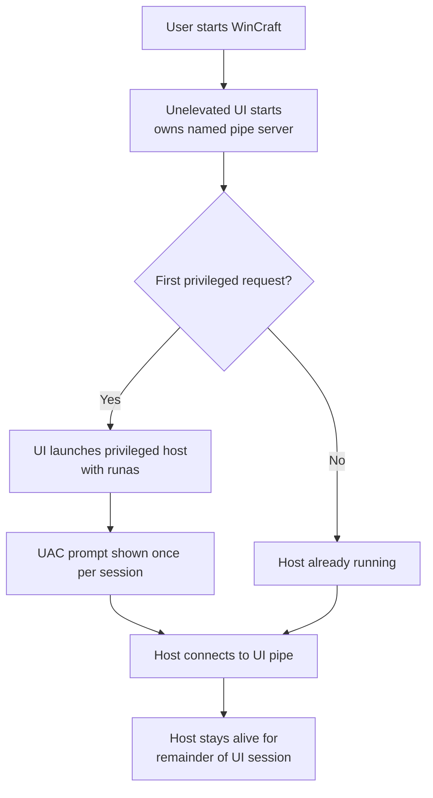
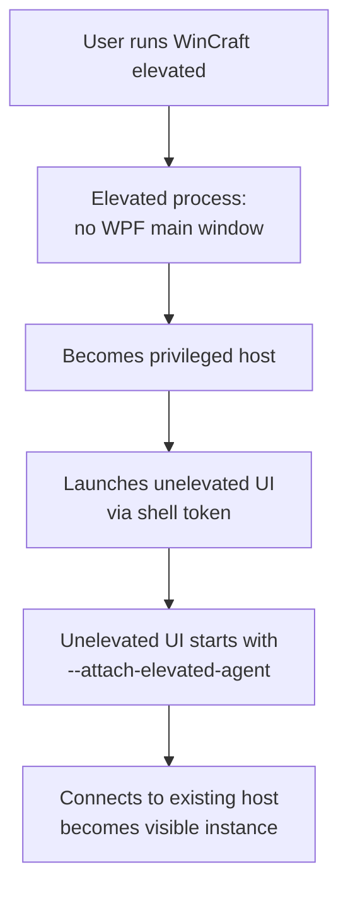
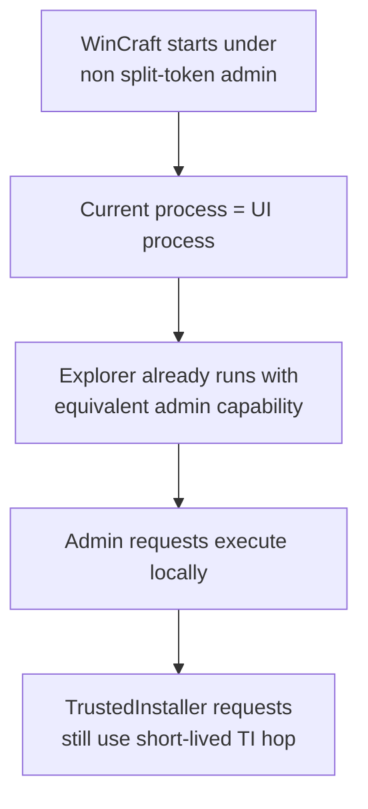

# Elevated Host IPC

WinCraft keeps the visible UI process unelevated at all times.
The UI owns shell integration, drag-and-drop, and single-instance activation.
Privileged work is delegated to an internal host process that can execute
requests as `Administrator` or, when required, through a short-lived
`TrustedInstaller` hop.

## Privilege Model

Every privileged request declares one explicit level:

- `Standard`
- `Administrator`
- `System`
- `TrustedInstaller`

The UI must not guess, retry, or silently promote a request. Product code picks
the intended level directly at the call site.

## Why the UI stays unelevated

Running the main window elevated breaks normal shell interaction:

- Explorer drag-and-drop and shell messages are blocked by integrity isolation.
- A permanently elevated UI would require a worse startup experience.
- WinCraft only needs higher privileges for a narrow set of infrastructure
  operations, not for the full interactive surface.

The product model is therefore:

- one unelevated UI
- one attached privileged host per UI session
- zero long-lived `TrustedInstaller` processes

## Startup Flows

### Normal launch

### Manual "Run as administrator"

### Built-in Administrator

## Process Roles

| Role | Pipe | Responsibilities |
|------|------|-----------------|
| **Unelevated UI** | Server | Single-instance activation, shell interaction / drag-and-drop, routes privileged work through `PrivilegeBroker` |
| **Privileged host** | Client | No main window; executes `Administrator` requests locally; upgrades `System` requests via one-shot SYSTEM process; upgrades `TrustedInstaller` requests via TI hop |
| **SYSTEM hop** | Dedicated | Duplicates `winlogon.exe` token, runs one operation, returns result, exits |
| **TrustedInstaller hop** | Dedicated | Duplicates `winlogon.exe` → SYSTEM hop → duplicate `TrustedInstaller.exe` token → run one operation → exit |

## IPC

The main UI/host channel remains:

- server: unelevated UI
- client: privileged host

This direction avoids the DACL and integrity barriers that make the reverse
direction unreliable.

Messages are still length-prefixed `DataContract` payloads over a named pipe.
Each request now includes:

- operation name
- serialized payload
- request id
- explicit privilege level

Adding a new privileged operation still means:

1. add an operation name in `ElevatedOperations`
2. add the handler in `ElevatedOperationExecutor`
3. choose the required `PrivilegeLevel` or registry privilege policy at the
   call site

## Identity Validation

For the long-lived UI/host pipe:

- the UI passes the expected host PID explicitly
- every long-lived host receives the expected UI PID explicitly, whether it was
  launched by the UI with `runas` or created first by "Run as administrator"
- the UI validates the connecting client PID on every connection
- the host exits when its bound UI PID disappears

For the TI one-shot pipe:

- the pipe name is random per request
- the request id is carried end-to-end and verified in the result
- the TI execute process connects once, returns one result, and exits

Cross-user scenarios remain out of scope.

## Lifecycle

- the privileged host is bound to one UI session
- for a UI-owned host, the UI sends a shutdown request during normal exit and
  may force-kill the host if it does not exit
- for an attached host, the UI does not own the process; the host exits after
  its bound UI PID disappears
- shutdown and missing-process handling are best-effort cleanup paths
- TI hop processes are never persistent
