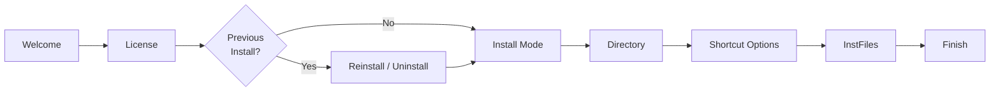
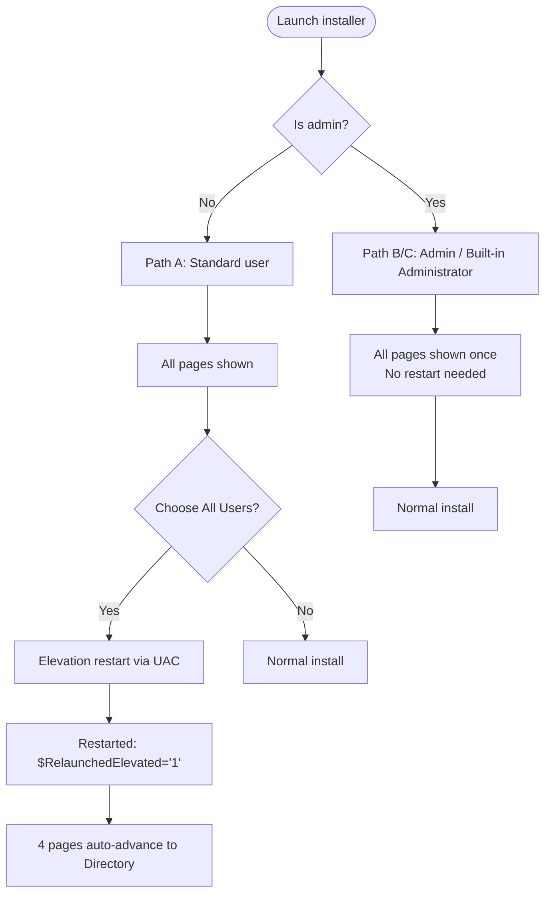
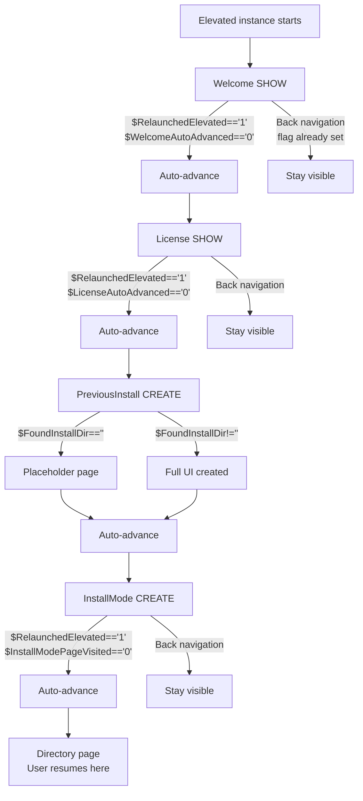
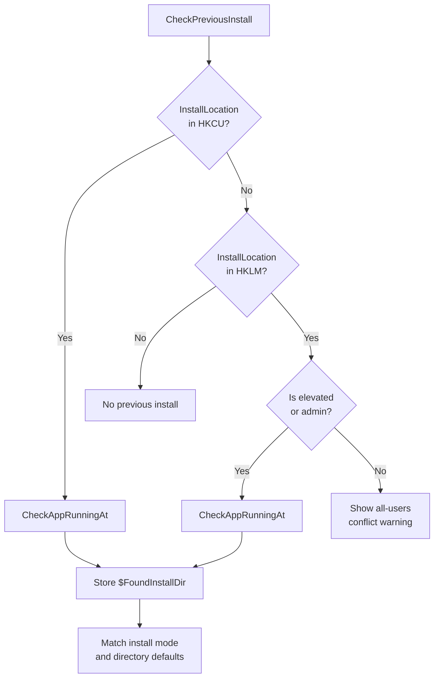
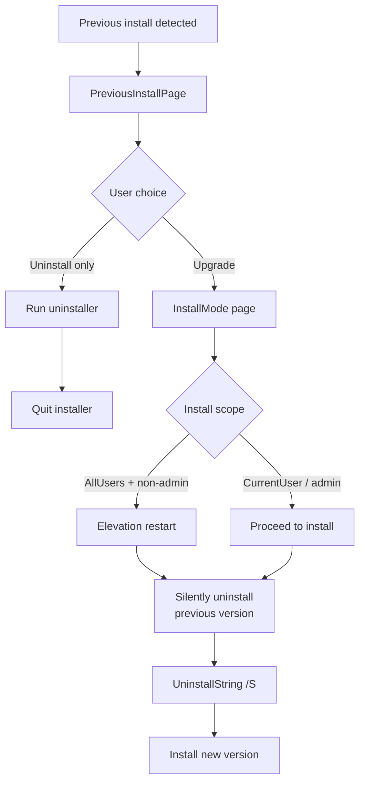
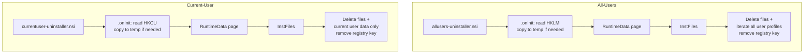
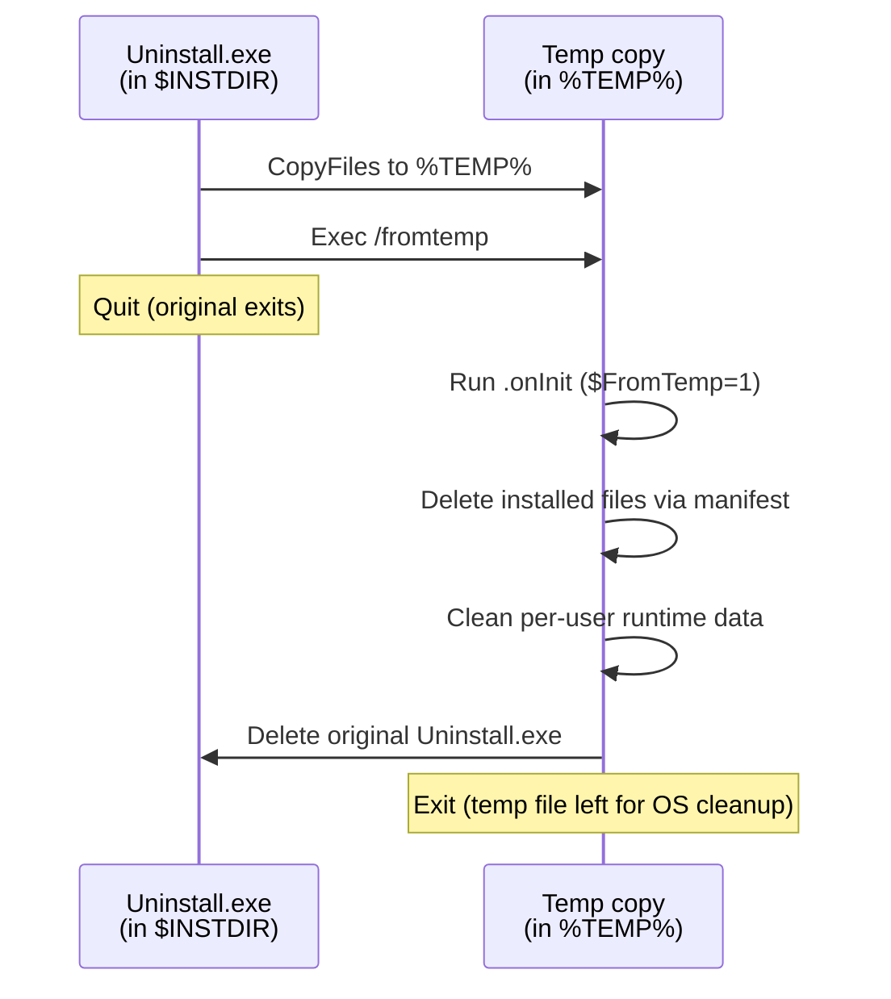
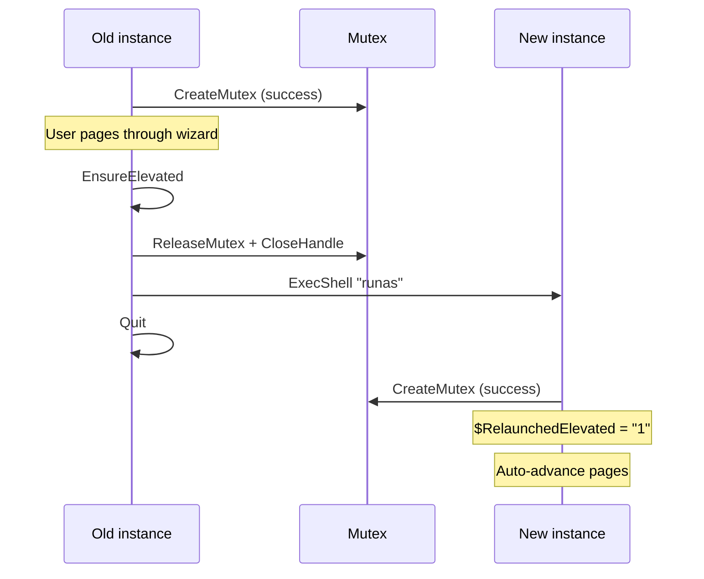
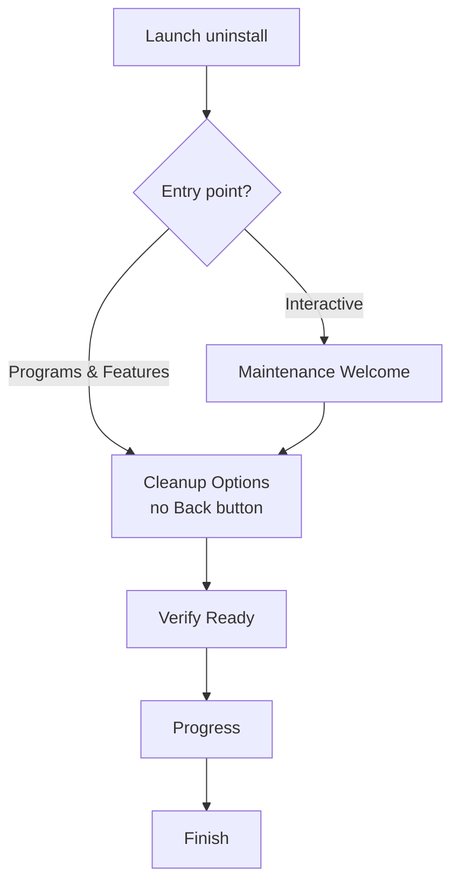
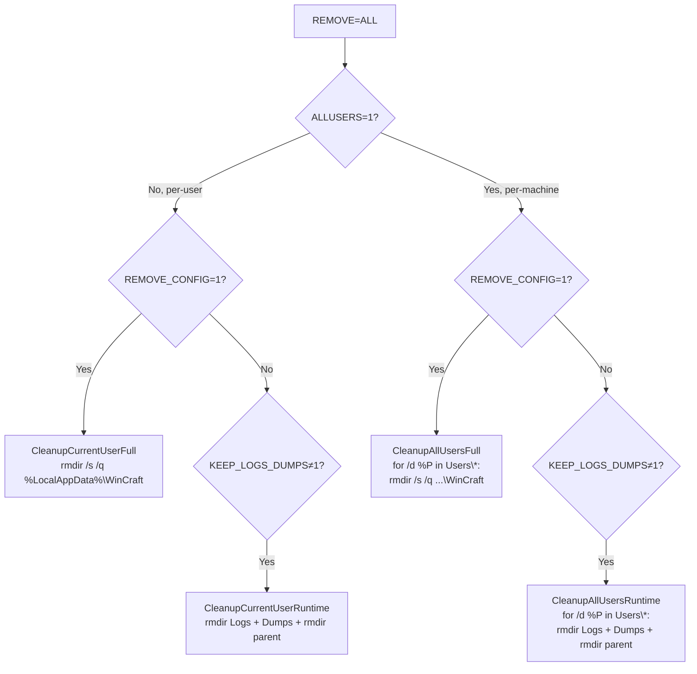

# Installer Flow & Reference

Page flows, decision points, and implementation details for both installers.
This is the authoritative source for installer logic — consult it before
modifying any `.nsi`, `.nsh`, `.wxs`, or `.psm1` files under `publish/`.

For install paths, shared behaviour, deployment commands, and user-facing
documentation see [installer-guide.md](installer-guide.md).

## Architecture

The MSI is an x86 package that installs to `%ProgramFiles(x86)%` on 64-bit
Windows; application executables are **AnyCPU** and run as native 64-bit on
x64 systems.  Both installers carry the Standard (`net45`) and Legacy
(`net30`) product lines, selecting the matching file set based on whether
.NET Framework 4.5+ is detected at install time.

NSIS does not have an MSI `ProductCode`.  The MSI keeps a stable
`UpgradeCode` (`3D17A351-F892-4555-93DB-9F4745BD7437`) for MSI-to-MSI
major upgrades.  The NSIS installer detects previous installations via
the standard Windows uninstall registry key; the MSI uses its own
product-code key and standard `MajorUpgrade` detection.

## NSIS Page Flow

### Page Chain

### Run Modes

Three ways to launch the installer, each producing a different page flow.

### Elevation Restart — Auto-Advance

Pattern: each page uses `$RelaunchedElevated == "1"` + a visited flag. On first forward pass, `SendMessage 0x408 1 0` advances to the next page while keeping the page in the wizard stack for Back navigation.

### Previous Install Detection

### Reinstall / Upgrade

### Uninstall

Both uninstallers accept `/upgrade` flag to preserve logs/dumps and run synchronously.

#### Why Two Separate Uninstallers

NSIS compiles uninstall logic into a self-contained EXE — behaviour that differs
between install scopes must be baked in at build time.  A single parameterised
uninstaller would carry dead code for the unused scope and make cleanup
correctness harder to verify.

**Self-deletion flow (both uninstallers)**

The copy is done in `.onInit` script code — our uninstallers are built with
`OutFile` and do not have the automatic copy behaviour that `WriteUninstaller`
provides.  The `/fromtemp` flag lets the temp copy distinguish itself and skip
the copy step.

**Compile-time differences between the two uninstallers**

| Aspect | `allusers-uninstaller.nsi` | `currentuser-uninstaller.nsi` |
|---|---|---|
| Registry hive | `HKLM` | `HKCU` |
| Execution level | `admin` (UAC shield) | `user` |
| Cleanup scope | All user profiles via `FindFirst "$PROFILE\..\*"` | Current user via `$LOCALAPPDATA` |
| Temp exe name | `WinCraft-AllUsers-Uninstall.exe` | `WinCraft-CurrentUser-Uninstall.exe` |
| Defines | `WINCRAFT_UNINSTALL_ALL_USERS_RUNTIME_DATA` | *(none)* |

`RequestExecutionLevel` is a PE manifest entry, not a run‑time switch — a
single EXE cannot carry both.  Likewise, `SetShellVarContext` resolves at
compile time; switching registry hives at run time would require guarding every
operation with `${If}`/`${Else}` blocks.

**Install‑time embedding**

The main installer (`installer.nsi`) compiles both uninstaller EXEs as inputs,
then embeds only the one matching the chosen scope via `File /oname=Uninstall.exe`.
`UninstallString` in the registry records the scope flag alongside the EXE path,
so the uninstaller never needs to re-detect its scope at run time.

### Decision Points

| Decision | Function | Mechanism |
|----------|----------|-----------|
| App running? | `CheckAppRunningAt` | `CreateFile` exclusive-write lock on `WinCraft.exe` |
| Is user admin? | `.onInit` | `UserInfo::GetAccountType` |
| Previous install exists? | `.onInit` | `ReadRegStr` HKCU then HKLM |
| Need elevation? | `EnsureElevated` | `$InstallMode == "AllUsers"` + not admin + not already restarted |
| Another installer running? | `.onInit` | Named mutex `WinCraft-Setup-Mutex` (session-local) |

### Mutex Lifecycle

Without the explicit release, the new instance would fail with `ERROR_ALREADY_EXISTS` because the old instance still holds the mutex when `ExecShell` spawns the new process.

---

## MSI Page Flow

The MSI (`WinCraft-Setup.msi`, built via WiX Toolset v4) uses
`WixUI_InstallDir` plus three custom dialogs.  It is authored as a single
per-user/per-machine MSI (`ALLUSERS=2`, `MSIINSTALLPERUSER=1`).
Interactive installs default to the current user; selecting all users shows
the normal Windows Installer elevation prompt.

### Fresh Install

- **Install Scope** (`WinCraftInstallScopeDlg`) — per-user / all-users radio.
- **Shortcut Options** (`ShortcutOptionsDlg`) — Desktop and Start Menu
  checkboxes; both selected by default.  No cross-install memory — each
  install starts with default selections.
- **Finish** — the standard WixUI ExitDialog shows a "Launch WinCraft"
  checkbox (checked by default) when `WixShellExecTarget` is defined.
  The MSI uses `WixShellExec` to launch the application without blocking
  installer shutdown.

### Maintenance (Uninstall)

WiX's `MaintenanceTypeDlg` (Change/Repair/Remove) is skipped — the package
does not expose change or repair workflows.  The **Cleanup Options**
(`CleanupOptionsDlg`) page offers:

| Option | Default | Property |
|--------|---------|----------|
| Keep configuration | On | `KEEP_CONFIG=1` |
| Delete logs and crash dumps | On | `DELETE_LOGS_DUMPS=1` |

### Uninstall Cleanup Custom Actions

Cleanup uses five deferred `WixQuietExec` custom actions.  When the user
chooses to remove configuration (`REMOVE_CONFIG="1"`), the entire
`%LOCALAPPDATA%\WinCraft` tree is deleted in one pass rather than piecemeal.
When configuration is kept but log/dump cleanup is requested, only the
`Logs` and `Dumps` subdirectories are removed.

All custom actions guard on `REMOVE="ALL" AND NOT UPGRADINGPRODUCTCODE` —
cleanup only fires during a final uninstall, not during a major upgrade.

---

## UI Images

Both installers use custom bitmaps for wizard pages.  All images are 24-bit
BMP files so the tools can embed them directly at compile time.  NSIS and WiX
assets are separate files — the two installers use different dimensions and
are not interchangeable.

| Installer | Role | NSIS define / WiX variable | Recommended size | File |
|---|---|---|---|---|
| NSIS | Page header | `MUI_HEADERIMAGE_BITMAP` | 150×57 |  |
| NSIS | Welcome / finish | `MUI_WELCOMEFINISHPAGE_BITMAP` | 164×314 |  |
| MSI | Page banner | `WixUIBannerBmp` | 493×58 |  |
| MSI | Dialog background | `WixUIDialogBmp` | 493×312 |  |

---

## WiX Bootstrapper Notes

WiX Burn can build a native `setup.exe` with a themeable standard bootstrapper
application and does not require .NET Framework for that built-in UI.  A
bootstrapper can pass MSI properties such as `ALLUSERS` and
`MSIINSTALLPERUSER` to chained MSI packages.

Burn is also the right shape if all-users installs must use native Program
Files on both CPU families: publish separate x86 and x64 MSI packages, then
chain the matching package based on OS architecture.

This repository does not currently publish a WiX bootstrapper because WiX v4's
standard bootstrapper UI is not a drop-in replacement for the current NSIS
install-scope flow.  The existing `WinCraft-Setup.exe` remains the NSIS
installer.  If a WiX bootstrapper is added later, keep the artifact name
distinct from the NSIS setup executable until release policy intentionally
switches installers.
