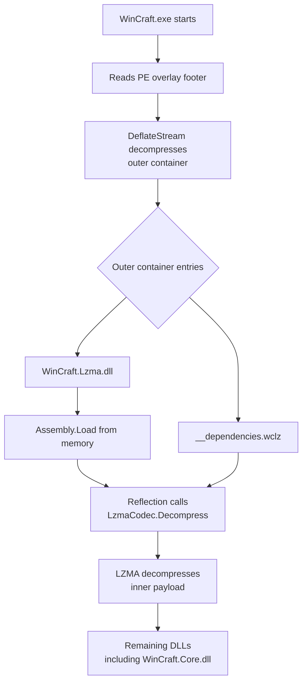

# Portable Single-File Executables

## Purpose

WinCraft ships portable single-file executables for both framework lines:

- `WinCraft-Legacy.exe` for `net30`
- `WinCraft-Standard.exe` for `net45`

The portable artifacts are not installer stubs.  They are normal WinCraft
executables with dependency assemblies appended as a PE overlay and loaded from
memory during startup.

Reusable compression support lives in `WinCraft.Lzma`.  LZMA is not only a
packaging concern: Core-level features can also use it for runtime compression
tasks such as dump-file compression.  Keeping LZMA in a separate project avoids
treating a product capability as executable bootstrap code.

## Current Design

The portable overlay uses a two-stage container:



The resolver intentionally invokes `WinCraft.Lzma.LzmaCodec` through reflection
after loading `WinCraft.Lzma.dll` from bytes.  A direct source reference from
`WinCraft.exe` to `WinCraft.Lzma` would add a normal assembly reference to the
executable metadata, but the referenced assembly only exists inside the overlay
at that point in startup.  Reflection keeps the bootstrap order explicit:
inflate the outer container, load the LZMA assembly, then call its decompressor.
This exception is limited to the executable overlay resolver.  Product code
should reference `WinCraft.Lzma` normally.

## Container Layout

The appended overlay footer is:

```text
[Deflate-compressed outer container]
[8 bytes LE: decompressed outer container length]
[4 bytes LE: compressed outer container length]
[4 bytes: magic "WOHY" = 0x59484F57]
```

Both the outer and inner dependency containers use the same flat entry format:

```text
[4 bytes LE: entry count]
For each entry:
  [2 bytes LE: UTF-8 name byte count]
  [name UTF-8 bytes]
  [4 bytes LE: data byte count]
  [data bytes]
```

The inner LZMA payload format is owned by `WinCraft.Lzma.LzmaCodec`:

```text
[5 bytes: LZMA properties]
[8 bytes LE: decompressed payload length]
[LZMA compressed payload]
```

Implementations: `src/WinCraft/Overlay/AssemblyResolver.cs` (runtime loader),
`publish/modules/overlay.psm1` (build-time packer),
`src/WinCraft.Lzma/LzmaCodec.cs` (LZMA codec).

## Explored Paths

| Approach | Size vs baseline | Complexity | Why not selected |
|----------|-----------------|------------|-----------------|
| Deflate-only | ~1.4× | Lowest | Payload too large |
| LZMA decoder in exe | Same as baseline | Low | Puts LZMA SDK source back into the executable project |
| **Deflate outer + LZMA inner** | **Baseline** | Medium | — (current design) |

## External Tools Considered

| Tool | Type | `net30` compat | Rejected because |
|------|------|---------------|-----------------|
| ILRepack | IL merger | Yes, but AV trigger | `net30` output triggered Huorong AV; IL rewriting breaks debugger/stack-trace/WPF expectations |
| ILMerge | IL merger | Via `/targetplatform` | Same static-linking drawbacks as ILRepack |
| Costura.Fody | Resource embedding | No | Targets .NET Standard 2.0 / .NET Framework 4.0 |
| MPRESS | PE packer | Yes | Triggered Huorong AV; opaque stubs reduce reproducibility and user trust |

## Decision Rules

- Keep product compression APIs in `WinCraft.Lzma`, not in the executable
  project.
- Keep `WinCraft.exe` limited to startup bootstrap and overlay assembly
  resolution.
- Prefer transparent managed containers over PE packers or IL rewriters.
- Avoid release outputs that increase antivirus false-positive risk.
- Validate both portable lines with `publish/build.ps1 -SkipNSIS -SkipMSI`
  after changing the overlay format.

## References Checked

- ILRepack project: <https://github.com/gluck/il-repack>
- ILRepack MSBuild task package: <https://www.nuget.org/packages/ILRepack.Lib.MSBuild.Task>
- ILMerge project: <https://github.com/dotnet/ILMerge>
- Costura project: <https://github.com/Fody/Costura>
- Current Costura.Fody package target: <https://www.nuget.org/packages/Costura.Fody>
- Costura.Fody 4.1.0 package target: <https://www.nuget.org/packages/Costura.Fody/4.1.0>
- MPRESS feature mirror: <https://github.com/requaos/mPress>
