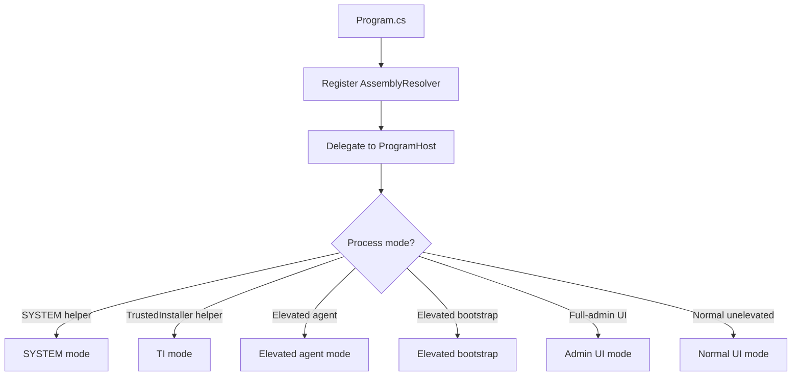

# Startup Lifecycle

## Purpose

This document explains the application entry point and startup ownership model.
It stays at the composition level: process roles, WPF application setup, and
single-instance activation. Privileged host IPC details live in
`docs/elevated-agent-ipc.md`.

## Entry Point

`Program.cs` is the only executable startup entry point. The project file sets
`StartupObject` to `WinCraft.Program`, so all process modes start there before
any WPF window is created.

`Program` is intentionally a thin executable shell. It registers
`AssemblyResolver` before touching code that may live in bundled
dependency assemblies, then delegates startup routing to `WinCraft.Startup`.
Keep this ordering intact: the executable project should not touch
`WinCraft.Core` types before the resolver is registered, because release
artifacts load Core from the compressed PE overlay instead of from a sidecar
DLL.

`ProgramHost` routes to the mode selected above. Keep this centralized in
`WinCraft.Startup`. New startup modes should enter through `Program`, then
route through `ProgramHost` and delegate to focused startup, infrastructure,
or feature code when behavior grows beyond startup composition.

## WPF Application Object

`App.xaml` exists to define the WPF `Application` type and hold application
resources. It is not the startup driver.

The UI process creates `App` and `MainWindow` through factories supplied by
`Program`, while `UserInterfaceStartup` owns the startup composition: it
initializes the application resources, registers dispatcher exception handling,
sets the main window, initializes application services, and runs the dispatcher
through the single-instance host. This keeps startup decisions in ordinary C#
code where command-line mode checks, elevation routing, and service setup can
be ordered explicitly.

There is intentionally no `App.xaml.cs` today. Add one only when the application
needs real WPF application-level event handling or shared `Application` state.
Do not add it just to move startup code out of `Program`; startup routing and
process selection belong in `WinCraft.Startup`.

## Single Instance Model

The visible UI is expected to be a single unelevated instance. `SingleInstanceHost`
owns that policy and runs the WPF dispatcher for the first instance.

When a later process starts with additional command-line arguments, the existing
UI receives the activation through `StartupNextInstance`. The active UI brings
its main window forward and handles the incoming command-line context.

This keeps shell interaction, drag-and-drop, and window activation in the
unelevated UI process. Elevated handoff behavior is part of the privileged host
model and is covered in `docs/elevated-agent-ipc.md`.

Built-in Administrator and other non split-token administrator sessions run the
UI directly instead of launching a separate unelevated copy. In that account
model the shell token already has the same administrator capability, so a
"downgrade" through Explorer would not reduce the UI token. Administrator-level
operations execute in-process, while `TrustedInstaller` operations still use the
privileged bridge.

## Design Notes

- Keep `Program` as a thin executable entry point that registers the overlay resolver before delegating to `ProgramHost`.
- Keep non-WPF startup and product logic in `WinCraft.Core`; the executable project should contain only WPF-specific types, entry-point code, app metadata, and overlay loading code.
- Keep process-mode routing and startup composition in `WinCraft.Startup`.
- Keep reusable process, command-line, IPC, and elevation helpers outside
  `ProgramHost` when they are not startup-specific.
- Keep WPF resources in `App.xaml`; keep startup routing out of XAML.
- Prefer adding focused infrastructure types over growing long inline startup
  workflows when a flow needs independent testing or reuse.
