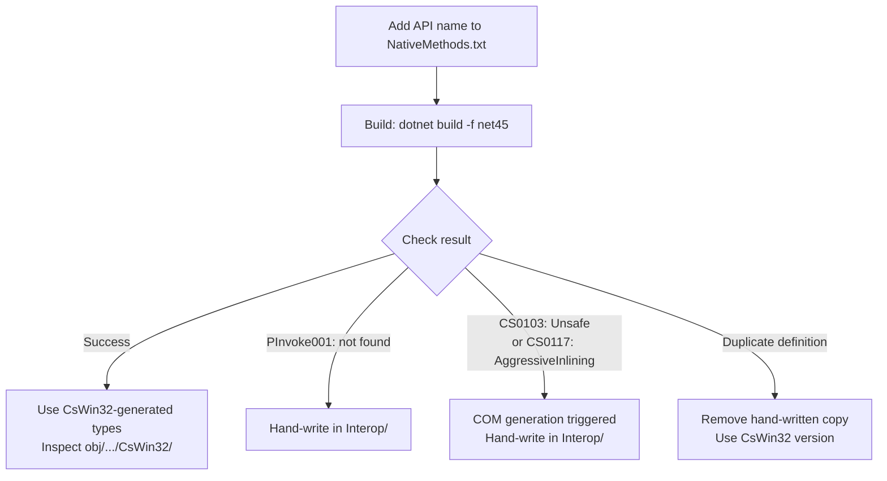

# Win32 Interop

## CsWin32 Workflow

Prefer `CsWin32` for Win32 API declarations, constants, enums, and COM interfaces
such as `IShellItem`.  Hand-written types that CsWin32 cannot generate go in
`src/WinCraft.Core/Interop/` — see "CsWin32 COM Interface Limitations" below.

When adding a Win32 API or COM interface:

1. Add entries to the owning project's `NativeMethods.txt` first. Most Win32
   infrastructure call sites live in `src/WinCraft.Core/NativeMethods.txt`;
   use the executable project's file only for Win32 calls that must remain in
   the thin startup executable.
2. Use the undecorated API or interface name, for example `CreateProcessWithTokenW`
   or `IShellItem`. COM interfaces are emitted with `[ComImport]` and `[Guid]`;
   CsWin32 also generates friendly extension methods for common patterns.
3. Build the project.
4. Inspect generated source under
   `obj/<config>/<tfm>/generated/Microsoft.Windows.CsWin32/`.
5. Use the exact generated C# signature and namespace at the call site.

Do not guess generated signatures from memory.

Group entries in `NativeMethods.txt` by functional area (e.g. `Process & Token`,
`Shell Drag-and-Drop`), not by data type (e.g. `Constants`, `Structs`).
Constants and types belong in the group that owns their domain.

## Authoring Decision Flow

For every new Win32 API, follow this order:

**Quick recognition — an API triggers COM generation if its signature
directly or transitively references any of these**:
- `IDataObject`, `IUnknown`, `IStream`, `IStorage`, `IMoniker`, `IBindCtx`
- `STGMEDIUM`, `FORMATETC`, `IEnumFORMATETC`
- `IShellItem`, `IShellItemArray`, `IShellFolder` (or any `I*` Shell COM interface)

A P/Invoke that takes only simple types (`IntPtr`, `HWND`, `BOOL`, `uint`,
`System.Drawing.Point`, `StringBuilder`, arrays of primitives) is safe for
CsWin32 and should never need hand-writing.

## Call Site Rules

When a CsWin32 API offers a friendly wrapper overload, such as `SafeFileHandle`,
`out`, or nullable value types, prefer it over the raw pointer overload. When
only the raw overload exists, note why with a short comment.

When calling Win32 APIs, use the CsWin32-generated P/Invoke wrappers by
default. Do not mix BCL wrappers such as `Process.GetCurrentProcess()` or
`Process.MainModule` with raw Win32 calls. The BCL wrappers often allocate extra
objects or surface different error semantics.

Use hand-written P/Invoke only when CsWin32 cannot emit the required binding.
Place hand-written COM interfaces, coclasses, and P/Invoke methods in
`src/WinCraft.Core/Interop/`; include a comment referencing this section.

## CsWin32 COM Interface Limitations

CsWin32-generated COM interface code relies on two runtime features
unavailable on `net30`:

| Feature | Required by | net30 status |
|---------|------------|-------------|
| `System.Runtime.CompilerServices.Unsafe` | COM struct vtable dispatch | No NuGet package targets net30 |
| `MethodImplOptions.AggressiveInlining` | `IComIID.Guid` property | Enum value absent in .NET 3.0 |

CsWin32 has no configuration switch to suppress either.  Theraot 3.2.11
does not backfill them.

**Rule**: When a COM interface is needed and the project targets `net30`,
use a traditional `[ComImport]` interface declaration.  Place it in
`src/WinCraft.Core/Interop/`, in a namespace matching CsWin32.
CsWin32-generated COM interfaces are viable only when `net30` support is
dropped or when the affected APIs are guarded with `#if NET45`.

**Conventions for hand-written types**:
- Namespace matches CsWin32 (COM types in `Windows.Win32.UI.Shell`, P/Invoke in `Windows.Win32`).
- P/Invoke files named `PInvoke.{DllName}.cs` extend the `PInvoke` partial class with a `private const string` for the DLL name.
- COM interface and coclass files named after the type (`IShellLink.cs`, `CShellLink.cs`).
- Struct and enum names use ALL_CAPS matching CsWin32 generated types; prefer CsWin32 generation over hand-writing for enums.
- Use `((HRESULT)result).Failed` / `.Succeeded` instead of `== 0` / `!= 0` for COM method returns.
- All placed in `src/WinCraft.Core/Interop/`.

## Windows Compatibility

When introducing or changing Win32 API usage, explicitly consider Windows
version compatibility. Do not assume that targeting `.NET Framework 3.0`
implies support for pre-Vista Windows behavior.

Document or guard APIs whose semantics depend on Vista-era features such as
UAC, split tokens, or elevation metadata.
